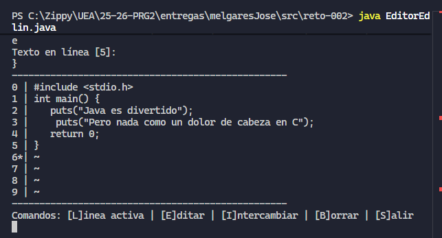

# Reto 002 - PRG 2

Esta carpeta incluye la solución propuesta para el [problema del reto-002](https://github.com/fogg928s4/25-26-PRG2/tree/main/evaluaciones/retos/reto002) de la materia de Programación 2.

El editor se ve de la siguiente manera:

## ⌛ Changelog

### [f735ba0](https://github.com/fogg928s4/25-26-PRG2/commit/f735ba0004fcf9953c92a7bc36b57db6dbf9fcc7)

Estructura inicial de la estructura de entrega. Crea la carpeta `entregas/melgaresJose/src/reto-002`. En este directorio se encuentra el archivo principal de código y el `README.md`.

### [8b73b8a](https://github.com/fogg928s4/25-26-PRG2/commit/8b73b8a1c8be91e945203e5e4cd338ffbeb9b45b)

Se han creado métodos estáticos para imprimir la pantalla inicial del programa. Junto a ello, se imprime la barra de estado de abajo con los comandos posibles y sus carácterres específicos.

### [f0d02d0](https://github.com/fogg928s4/25-26-PRG2/commit/f0d02d0502c49f4684b05fe3d4e7620c638968df)

Se ha creado la estructura base del switch de opciones. Los distintos comandos se mapean a enteros para una mejor toma de datos y redirección a los distintos métodos de los comandos.

### [94a3835](https://github.com/fogg928s4/25-26-PRG2/commit/94a3835d33d3dac33cd1311d2953d7e0fdfd3b33)

Se mejora la impresión del buffer, y se mejora la inicialización de las variables necesarias. También se cambia el mapeo de opciones.

### [da98d74](https://github.com/fogg928s4/25-26-PRG2/commit/da98d7487b792897ee0c111a435893d02ef98921)

En la línea activa es posible la ejecución apropiada de los comandos. Es posible cambiar la línea activa, intercambiar el texto en dos líneas, borrar el buffer y por supuesto, editar el contenido de la línea activa.

### [e25f4a5](https://github.com/fogg928s4/25-26-PRG2/commit/e25f4a5b8cfb2cfe94325e8389a5d5ba082ae121)

La estructura de la inicialización de datos se corrige, evitando *números mágicos*. También se aclaran los nombres de algunos métodos estáticos.

### [673a112](https://github.com/fogg928s4/25-26-PRG2/commit/673a112aeef88988d30cc667e119644bc1f2271e)

Existía un error al momento de intentar salir del editor, pues este se ejecutaba una vez más incluso al seleccionar la opción correspondiente al no haber ninguna validación de la continuidad de ejecución.

### [67450a2](https://github.com/fogg928s4/25-26-PRG2/commit/67450a2585aecd1dc3a48c1229fab50de82d18ed)

Documentación para el README, agregando una captura de pantalla para mejorar la presentación.

### [31760cc](https://github.com/fogg928s4/25-26-PRG2/commit/31760cc3d092affec1da4a6e00c55629e26018e6)

Existía un error al continuar ejecutando comandos de excepción. Esto era debido a que los escáneres se cerraban, después de cada lectura. Este commit solventa ello.

### [5703a88](https://github.com/fogg928s4/25-26-PRG2/commit/5703a88fc0ca5e61b38df2db73bbc17113aa1631)

Luego de editar la línea activa, el editor la mueve una posición hacia adelante para mejorar le experiencia de edición.

### [f892bfd](https://github.com/fogg928s4/25-26-PRG2/commit/f892bfd61d696e4679b6261d62bd2544e74a82f8)

Cambia la funcionalidad del comando B. Anteriormente, este borraba todo el buffer del editor. Ahora, solamente borra el contenido de la línea activa.