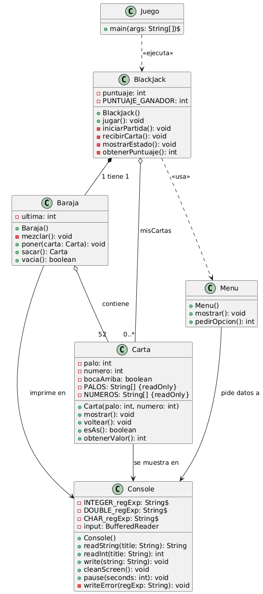

# BlackJack Java

Juego de **BlackJack** para consola desarrollado en Java. Implementa una lógica de jugador solitario centrada en la gestión de puntuación y toma de decisiones.

---

## Origen del Código
Este proyecto reutiliza y adapta la estructura base del juego **Klondike** para optimizar el desarrollo:

* **Base Klondike:** Se aprovecharon las clases `Menu`, `Baraja` y `Carta`.
* **Adaptación:** Se eliminaron métodos de movimiento de columnas y lógica de ordenamiento secuencial, sustituyéndolos por un sistema de **cálculo de valor nominal** y gestión de **Ases dinámicos**.

---

##  Reglas de Puntuación
La lógica de puntaje se calcula automáticamente siguiendo estas reglas:

* **2 al 9:** Valor nominal (índice + 1).
* **10, X, J, Q, K:** 10 puntos.
* **As (A):** 1 u 11 puntos por defecto.

---

## Menú de Juego
El usuario interactúa mediante las siguientes opciones:

1.  **Pedir:** Solicita una carta adicional a la baraja.
2.  **Empezar de Nuevo:** Reinicia la mano actual y mezcla una baraja nueva.
3.  **Parar:** Finaliza la partida con el puntaje acumulado.

---

